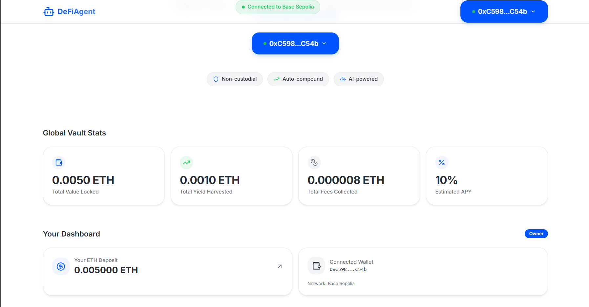
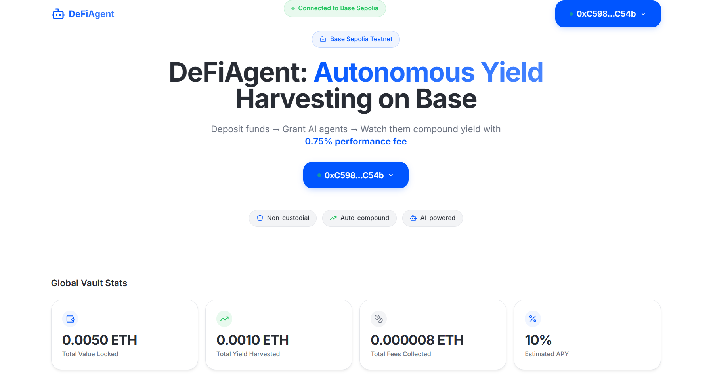
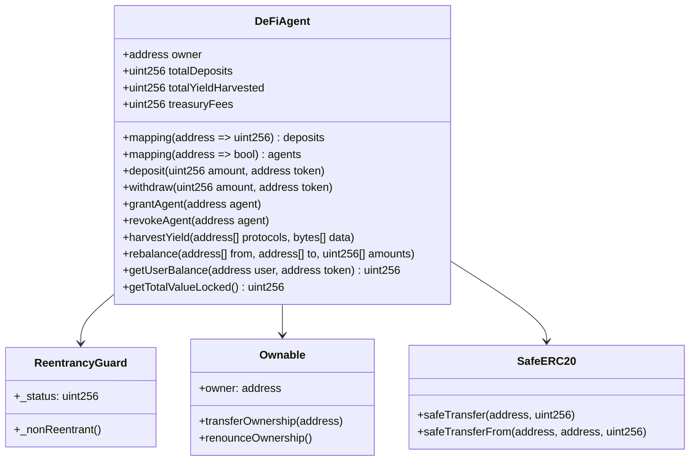
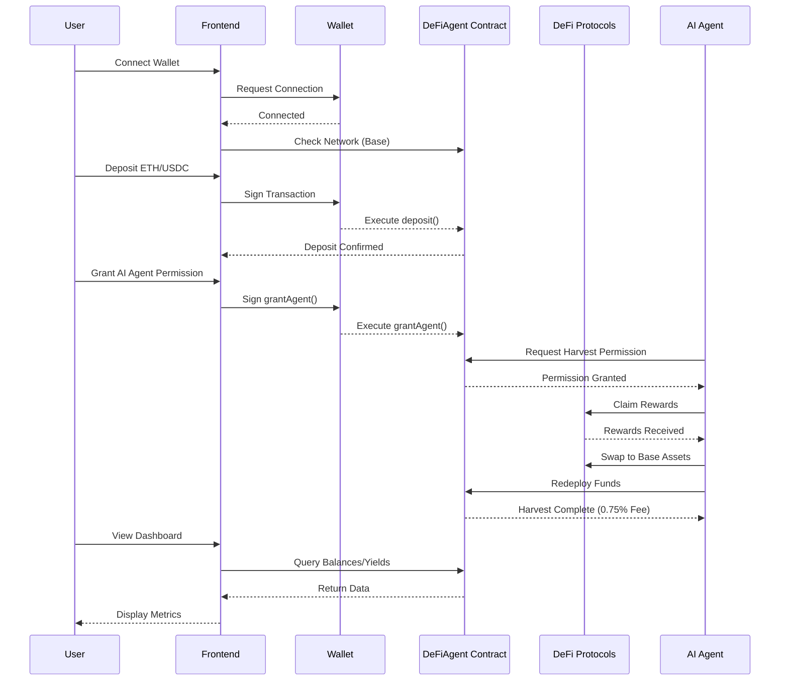
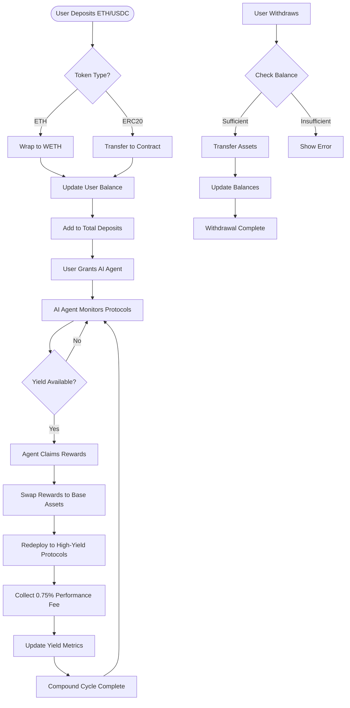
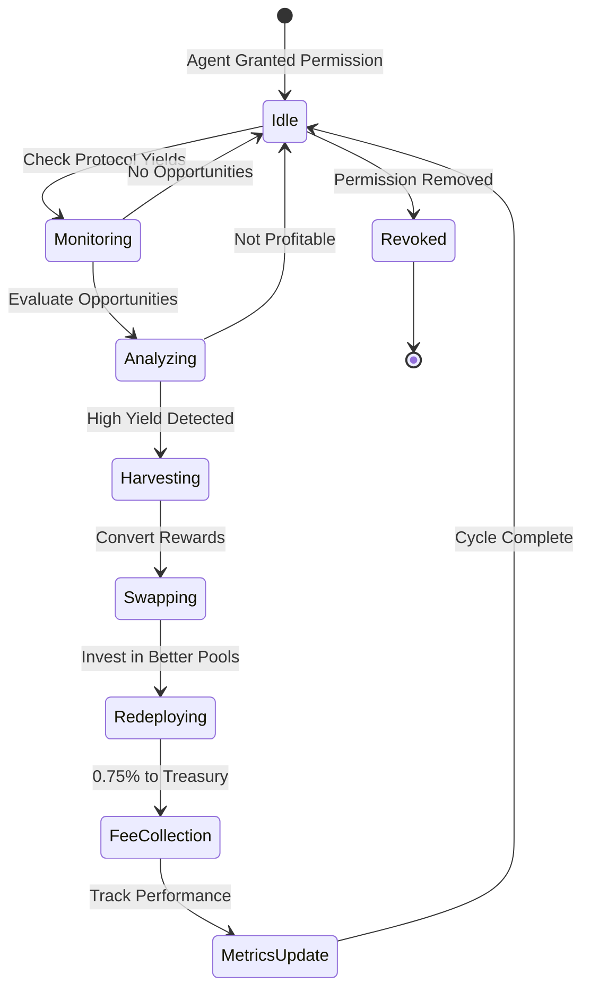

# DeFiAgent Autonomous DeFi + AI Vault on Base

[](https://soliditylang.org/)
[](https://book.getfoundry.sh/)
[](https://reactjs.org/)
[](https://base.org/)
[](LICENSE)



🌐 **[Live Demo](https://defiagent.vercel.app/)** | 📋 [Contract on Base Sepolia](https://sepolia.basescan.org/address/0x409e9222f69b11f84bc9e54794061315e27f5f64)

## Table of Contents

- [Overview](#overview)
- [Project Structure](#-project-structure)
- [Features](#-features)
- [Architecture](#️-architecture)
- [How It Works](#-how-it-works)
- [Prerequisites](#-prerequisites)
- [Installation & Setup](#️-installation--setup)
- [Usage](#-usage)
- [Deployment](#-deployment)
- [Testing](#-testing)
- [API Reference](#-api-reference)
- [Contributing](#-contributing)
- [Troubleshooting](#-troubleshooting)
- [License](#-license)
- [Links](#-links)
- [Acknowledgments](#-acknowledgments)

## Overview

DeFiAgent is an autonomous DeFi vault on Base that enables users to deposit ETH/USDC and grant AI agents permission to auto-compound yield across leading Base DeFi protocols (Aerodrome, Moonwell, etc.). The vault collects a sustainable 0.75% performance fee on harvested yield to support ecosystem development.

**Deposit → Grant AI Agent → Watch It Compound → 0.75% Fee Powers Builders**

## 📁 Project Structure

```
DeFiAgent/
├── solidityContract/          # Smart contracts (Foundry)
│   ├── src/
│   │   └── DeFiAgent.sol      # Main vault contract
│   ├── test/
│   │   └── DeFiAgent.t.sol    # Comprehensive test suite
│   ├── script/
│   │   └── DeployDeFiAgent.s.sol # Deployment script
│   ├── README.md
│   └── foundry.toml
├── frontend/                  # React frontend with Web3 integration
│   ├── src/
│   │   ├── components/        # UI components
│   │   ├── pages/             # Page components
│   │   ├── hooks/             # Custom React hooks
│   │   └── config/            # Web3 configuration
│   ├── public/
│   └── package.json
├── docs/                      # Additional documentation
├── .env.example               # Environment variables template
├── .gitignore
└── README.md                  # This file
```

## 🚀 Features

### Smart Contract (DeFiAgent.sol)
- **Multi-Asset Deposits**: ETH and ERC20 tokens (USDC, etc.)
- **AI Agent Permissions**: Grant/revoke agents for autonomous operations
- **Yield Harvesting**: Agents claim rewards, swap, redeposit with 0.75% fee
- **Rebalancing**: Strategic fund movements (extensible)
- **Security First**: ReentrancyGuard, SafeERC20, access controls
- **Tracking**: Real-time metrics for deposits, yields, fees

### Frontend
- **User Dashboard**: Deposit/withdraw interface with real-time balances
- **Agent Management**: Grant permissions to AI agents with approval flows
- **Yield Monitoring**: Live APY, harvested yields, fees, and performance charts
- **Base Integration**: Seamless wallet connections with automatic network switching
- **Responsive Design**: Mobile-friendly UI built with Tailwind CSS and shadcn/ui



## 🏗️ Architecture

### Overall System Architecture

```mermaid
graph TB
    subgraph "User Layer"
        A[Web Browser]
        B[Wallet (MetaMask, etc.)]
    end
    
    subgraph "Frontend Layer"
        C[React App]
        D[Vite Build Tool]
        E[Wagmi/Viem Web3]
    end
    
    subgraph "Blockchain Layer"
        F[Base Network]
        G[DeFiAgent Contract]
    end
    
    subgraph "DeFi Ecosystem"
        H[Aerodrome]
        I[Moonwell]
        J[Other Protocols]
    end
    
    subgraph "AI Layer"
        K[AI Agent Service]
        L[Yield Optimization AI]
    end
    
    A --> B
    B --> C
    C --> E
    E --> F
    F --> G
    G --> H
    G --> I
    G --> J
    K --> G
    L --> K
```

### Smart Contract Architecture



### System Integration Flow



## 🔄 How It Works

### Deposit and Yield Compounding Flow



### AI Agent Operation Cycle



## 📋 Prerequisites

- [Foundry](https://book.getfoundry.sh/getting-started/installation.html) for smart contract development and testing
- [Node.js](https://nodejs.org/) (v18+) and [pnpm](https://pnpm.io/) for frontend development
- [Git](https://git-scm.com/) for version control
- A Web3 wallet (MetaMask, Coinbase Wallet, etc.) for blockchain interactions
- Base Sepolia testnet ETH for gas fees (get from [Base Faucet](https://docs.base.org/tools/network-faucets))

## 🛠️ Installation & Setup

### 1. Clone Repository
```bash
git clone https://github.com/yourusername/DeFiAgent.git
cd DeFiAgent
```

### 2. Smart Contracts Setup
```bash
cd solidityContract
# Install dependencies
forge install
# Run tests
forge test -vvv
# Build contracts
forge build
```

### 3. Frontend Setup
```bash
cd ../frontend
# Install dependencies
pnpm install
# Start development server
pnpm run dev
# Build for production
pnpm run build
```

### 4. Environment Configuration
```bash
cp .env.example .env
# Edit .env with your configuration:
# VITE_WALLETCONNECT_PROJECT_ID=your_project_id
# VITE_BASE_SEPOLIA_RPC_URL=https://sepolia.base.org
# PRIVATE_KEY=your_private_key_for_deployment
```

## 🚀 Usage

### For Users

1. **Connect Wallet**: Visit the frontend and connect your Web3 wallet
2. **Switch to Base Network**: The app will automatically prompt network switching
3. **Deposit Assets**: Choose ETH or USDC and deposit into the vault
4. **Grant AI Agent**: Approve an AI agent to manage your funds autonomously
5. **Monitor Performance**: View real-time yields, APY, and harvested fees
6. **Withdraw Anytime**: Remove your assets with accrued yields

### For Developers

#### Contract Interaction
```javascript
import { ethers } from 'ethers';
import DeFiAgentABI from './DeFiAgent.json';

const contract = new ethers.Contract(contractAddress, DeFiAgentABI, signer);

// Deposit ETH
await contract.deposit(ethers.utils.parseEther('1'), ethers.constants.AddressZero);

// Grant agent permission
await contract.grantAgent(agentAddress);

// Check balance
const balance = await contract.getUserBalance(userAddress, tokenAddress);
```

#### Frontend Development
```bash
cd frontend
pnpm run dev  # Development server at http://localhost:5173
pnpm run build  # Production build
pnpm run preview  # Preview production build
```

## 🚢 Deployment

### Smart Contract Deployment

#### Base Sepolia Testnet
- **Contract Address**: [0x409E9222f69B11F84bC9e54794061315E27f5F64](https://sepolia.basescan.org/address/0x409e9222f69b11f84bc9e54794061315e27f5f64)
- **Treasury Address**: 0x1804c8AB1F12E6Bbf3894d4083f33e07309d1f38

#### Deploy to Testnet
```bash
cd solidityContract
# Set your private key
export PRIVATE_KEY=your_private_key
# Deploy
forge script script/DeployDeFiAgent.s.sol --rpc-url https://sepolia.base.org --broadcast --verify
```

#### Deploy to Mainnet
```bash
# Use Base mainnet RPC
forge script script/DeployDeFiAgent.s.sol --rpc-url https://mainnet.base.org --broadcast --verify
```

### Frontend Deployment

#### Vercel (Recommended)
The project is configured for Vercel deployment with the frontend in a subfolder. The `vercel.json` configuration handles the build process automatically.

**Option 1: Deploy from Root Directory (Recommended)**
```bash
# Install Vercel CLI
npm install -g vercel

# Deploy to production
vercel --prod

# Or link your GitHub repo for automatic deployments
vercel link
```

**Option 2: Deploy from Frontend Directory**
```bash
cd frontend
vercel --prod
```

**Vercel Configuration Details:**
- **Build Command**: `cd frontend && pnpm build`
- **Output Directory**: `frontend/dist`
- **Node Version**: 18.x or higher
- **Framework Preset**: Vite

**Environment Variables for Vercel:**
```
VITE_WALLETCONNECT_PROJECT_ID=your_walletconnect_project_id
VITE_BASE_SEPOLIA_RPC_URL=https://sepolia.base.org
VITE_BASE_MAINNET_RPC_URL=https://mainnet.base.org
```

#### Netlify
```bash
cd frontend
pnpm run build
# Upload the dist/ folder to Netlify
# Or use Netlify CLI
npm install -g netlify-cli
netlify deploy --prod --dir=dist
```

## 🧪 Testing

### Smart Contract Tests
```bash
cd solidityContract
# Run all tests
forge test
# Run with verbose output
forge test -vvv
# Run specific test
forge test --match-test testDeposit
# Run with gas reporting
forge test --gas-report
```

### Frontend Tests
```bash
cd frontend
# Run unit tests
pnpm test
# Run with coverage
pnpm test -- --coverage
# Run E2E tests (if configured)
pnpm run test:e2e
```

### Test Coverage
```bash
cd solidityContract
forge coverage --report lcov
# View coverage report in HTML
```

## 📚 API Reference

### DeFiAgent Contract Functions

#### Core Functions
- `deposit(uint256 amount, address token)` - Deposit assets into the vault
- `withdraw(uint256 amount, address token)` - Withdraw assets from the vault
- `grantAgent(address agent)` - Grant AI agent permission to manage funds
- `revokeAgent(address agent)` - Revoke AI agent permission
- `harvestYield(address[] protocols, bytes[] data)` - Execute yield harvesting (agent only)
- `rebalance(address[] from, address[] to, uint256[] amounts)` - Rebalance portfolio (agent only)

#### View Functions
- `getUserBalance(address user, address token) returns (uint256)` - Get user balance
- `getTotalValueLocked() returns (uint256)` - Get total TVL
- `getYieldHarvested() returns (uint256)` - Get total harvested yield
- `getTreasuryFees() returns (uint256)` - Get collected fees
- `isAgent(address account) returns (bool)` - Check if address is authorized agent

#### Events
- `Deposit(address indexed user, address indexed token, uint256 amount)`
- `Withdraw(address indexed user, address indexed token, uint256 amount)`
- `AgentGranted(address indexed agent)`
- `AgentRevoked(address indexed agent)`
- `YieldHarvested(uint256 amount, uint256 fee)`
- `Rebalanced(address[] from, address[] to, uint256[] amounts)`

## 🤝 Contributing

We welcome contributions! Please follow these steps:

1. Fork the repository
2. Create a feature branch (`git checkout -b feature/amazing-feature`)
3. Commit your changes (`git commit -m 'Add amazing feature'`)
4. Push to the branch (`git push origin feature/amazing-feature`)
5. Open a Pull Request

### Development Guidelines
- Write comprehensive tests for new features
- Follow Solidity style guide and best practices
- Use clear, descriptive commit messages
- Update documentation for any new features
- Ensure all tests pass before submitting PR

### Code Style
- **Solidity**: Use OpenZeppelin contracts and follow their patterns
- **JavaScript/TypeScript**: Use ESLint configuration, follow React best practices
- **Documentation**: Keep README and code comments up to date

## 🔧 Troubleshooting

### Common Issues

#### Frontend Issues
- **White screen on load**: Check browser console for errors, ensure all dependencies are installed
- **Wallet connection fails**: Verify wallet is unlocked and on Base network
- **Transaction fails**: Check gas fees, account balance, and network status

#### Contract Issues
- **Deployment fails**: Verify private key, RPC URL, and sufficient testnet funds
- **Tests fail**: Ensure Foundry is properly installed and dependencies are resolved
- **Function reverts**: Check require statements and access controls

#### Network Issues
- **Wrong network**: Frontend automatically switches to Base, but manual wallet switching may be needed
- **RPC errors**: Use reliable RPC endpoints, consider using Infura or Alchemy

### Getting Help
- Check existing [Issues](https://github.com/yourusername/DeFiAgent/issues) on GitHub
- Join our [Discord](https://discord.gg/defiagent) for community support
- Review the [documentation](./docs/) for detailed guides

## 📄 License

This project is licensed under the MIT License - see the [LICENSE](LICENSE) file for details.

## 🔗 Links

- [Base Network Documentation](https://docs.base.org/)
- [Foundry Book](https://book.getfoundry.sh/)
- [OpenZeppelin Contracts](https://docs.openzeppelin.com/contracts/)
- [Base Sepolia Explorer](https://sepolia.basescan.org/)
- [Wagmi Documentation](https://wagmi.sh/)
- [Vite Guide](https://vitejs.dev/guide/)
- [Tailwind CSS](https://tailwindcss.com/)

## 🙏 Acknowledgments

- **Base Ecosystem** for providing the scalable L2 infrastructure
- **OpenZeppelin** for battle-tested smart contract libraries
- **Foundry** for the fastest smart contract development toolchain
- **Vercel** for seamless frontend deployment
- **The DeFi Community** for inspiration and continuous innovation

---

**Built for the future of DeFi on Base. Ready for mainnet launch!** 🚀

*DeFiAgent - Where AI meets DeFi for autonomous yield maximization.*

*Built for the future of autonomous DeFi on Base.*