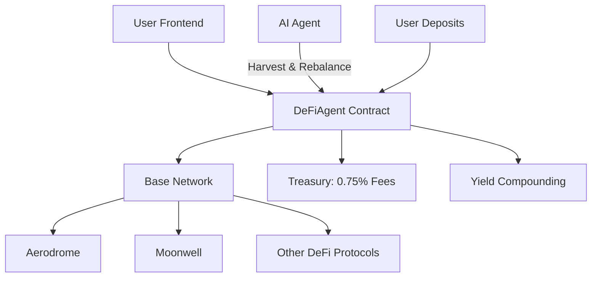

# DeFiAgent — Autonomous DeFi + AI Vault on Base

[](https://soliditylang.org/)
[](https://book.getfoundry.sh/)
[](https://reactjs.org/)
[](https://base.org/)
[](LICENSE)

## 🌟 Overview

DeFiAgent is an autonomous DeFi vault on Base that enables users to deposit ETH/USDC and grant AI agents permission to auto-compound yield across leading Base DeFi protocols (Aerodrome, Moonwell, etc.). The vault collects a sustainable 0.75% performance fee on harvested yield to support ecosystem development.

**Deposit → Grant AI Agent → Watch It Compound → 0.75% Fee Powers Builders**

## 📁 Project Structure

```
DeFiAgent/
├── solidityContract/          # Smart contracts (Foundry)
│   ├── src/
│   ├── test/
│   ├── script/
│   └── README.md
├── frontend/                  # React frontend (coming soon)
├── docs/                      # Additional documentation
├── .env.example               # Environment variables template
├── .gitignore
└── README.md                  # This file
```

## 🚀 Features

### Smart Contract (DeFiAgent.sol)
- **Multi-Asset Deposits**: ETH and ERC20 tokens (USDC, etc.)
- **AI Agent Permissions**: Grant/revoke agents for autonomous operations
- **Yield Harvesting**: Agents claim rewards, swap, redeposit with 0.75% fee
- **Rebalancing**: Strategic fund movements (extensible)
- **Security First**: ReentrancyGuard, SafeERC20, access controls
- **Tracking**: Real-time metrics for deposits, yields, fees

### Frontend (Planned)
- **User Dashboard**: Deposit/withdraw interface
- **Agent Management**: Grant permissions to AI agents
- **Yield Monitoring**: Live APY, harvested yields, fees
- **Base Integration**: Seamless wallet connections

## 🏗️ Architecture



## 📋 Prerequisites

- [Foundry](https://book.getfoundry.sh/getting-started/installation.html) for contracts
- [Node.js](https://nodejs.org/) (v18+) for frontend
- [Git](https://git-scm.com/)

## 🛠️ Installation & Setup

### 1. Clone Repository
```bash
git clone https://github.com/yourusername/DeFiAgent.git
cd DeFiAgent
```

### 2. Smart Contracts
```bash
cd solidityContract
forge install
forge test
```

### 3. Frontend (When Available)
```bash
cd ../frontend
npm install
npm run dev
```

### 4. Environment Setup
```bash
cp .env.example .env
# Fill in your API keys, RPC URLs, private keys
```

## 🚢 Deployment

### Base Sepolia Testnet
- **Contract**: [0x409E9222f69B11F84bC9e54794061315E27f5F64](https://sepolia.basescan.org/address/0x409e9222f69b11f84bc9e54794061315e27f5f64)
- **Treasury**: 0x1804c8AB1F12E6Bbf3894d4083f33e07309d1f38

### Deploy Script
```bash
cd solidityContract
./deploy.sh
```

## 🧪 Testing

### Contracts
```bash
cd solidityContract
forge test -vvv
```

### Frontend (When Available)
```bash
cd frontend
npm test
```

## 🤝 Contributing

1. Fork the repository
2. Create feature branch (`git checkout -b feature/amazing-feature`)
3. Commit changes (`git commit -m 'Add amazing feature'`)
4. Push to branch (`git push origin feature/amazing-feature`)
5. Open Pull Request

### Development Guidelines
- Write comprehensive tests
- Follow Solidity best practices
- Use clear commit messages
- Update documentation

## 📄 License

MIT License - see [LICENSE](LICENSE) for details.

## 🔗 Links

- [Base Network](https://base.org/)
- [Foundry Documentation](https://book.getfoundry.sh/)
- [OpenZeppelin Contracts](https://docs.openzeppelin.com/contracts/)
- [Base Sepolia Explorer](https://sepolia.basescan.org/)

## 🙏 Acknowledgments

- Base ecosystem for the amazing infrastructure
- OpenZeppelin for secure contract libraries
- Foundry for blazing-fast development tools

---

**Ready for Base Sepolia → Mainnet DeFAI Launch!** 🚀

*Built for the future of autonomous DeFi on Base.*