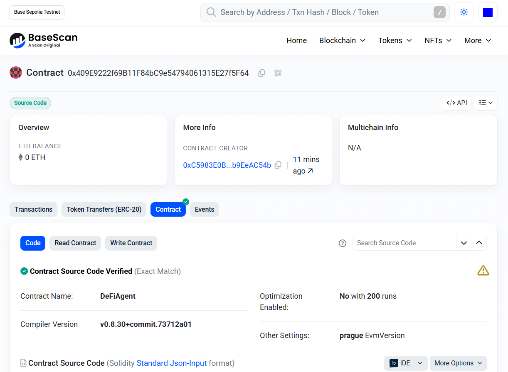
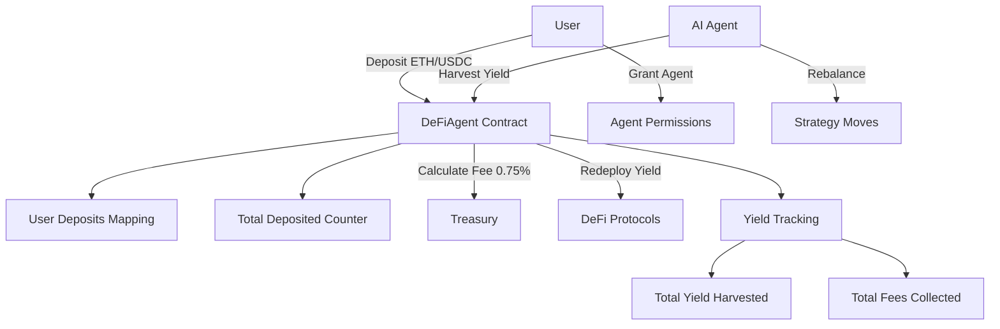

# DeFiAgent — Autonomous Yield on Base

[](https://soliditylang.org/)
[](https://book.getfoundry.sh/)
[](LICENSE)
[](https://sepolia.basescan.org/)



## Description

DeFiAgent is an autonomous DeFi vault on Base that enables users to deposit ETH/USDC and grant AI agents permission to auto-compound yield across Base DeFi protocols (Aerodrome, Moonwell, etc.), with 0.75% performance fee on harvested yield to treasury.

**Deposit → Grant AI agent → Watch it compound → 0.75% fee supports builders**

## Table of Contents

- [Features](#features)
- [Architecture](#architecture)
- [Deployment](#deployment)
- [Usage](#usage)
- [Testing](#testing)
- [Contributing](#contributing)
- [License](#license)

## Features

- **Deposit Assets**: Deposit ETH or ERC20 tokens (e.g., USDC) into the vault.
- **Agent Permissions**: Grant/revoke AI agents permission to harvest and rebalance.
- **Yield Harvesting**: Agents claim rewards, swap to base assets, and redeposit with 0.75% performance fee.
- **Rebalancing**: Agents move funds between strategies (placeholder for future implementation).
- **Withdrawals**: Owner can withdraw assets.
- **Tracking**: Monitor total deposited, harvested yield, and collected fees.
- **Security**: ReentrancyGuard, SafeERC20, and access controls.

## Architecture

### System Overview



### Contract Structure

- **DeFiAgent.sol**: Main contract handling deposits, agent management, harvesting, and withdrawals.
- **Modifiers**: `onlyOwnerOrAgent` for access control.
- **Events**: Deposited, YieldHarvested, AgentGranted, AgentRevoked.
- **Views**: getTotalDeposited, getUserBalance, estimatedAPY.

## Deployment

### Base Sepolia Testnet

- **Contract Address**: [0x409E9222f69B11F84bC9e54794061315E27f5F64](https://sepolia.basescan.org/address/0x409e9222f69b11f84bc9e54794061315e27f5f64)
- **Treasury**: 0x1804c8AB1F12E6Bbf3894d4083f33e07309d1f38
- **Chain ID**: 84532
- **Block**: 35959125
- **Transaction**: [0x072d3d3c629fe4205e4de41ecaf9672713f5e7bb5e459f73401cebe62701979f](https://sepolia.basescan.org/tx/0x072d3d3c629fe4205e4de41ecaf9672713f5e7bb5e459f73401cebe62701979f)

### Deploy Script

Run `./deploy.sh` to deploy to Base Sepolia. Requires `.env` with `BASE_SEPOLIA_RPC_URL` and `BASESCAN_API_KEY`.

## Usage

### Deposit ETH

```solidity
deFiAgent.depositETH{value: 1 ether}();
```

### Deposit ERC20

```solidity
token.approve(address(deFiAgent), amount);
deFiAgent.depositERC20(tokenAddress, amount);
```

### Grant Agent

```solidity
deFiAgent.grantAgent(agentAddress);
```

### Harvest Yield (Agent)

```solidity
deFiAgent.agentHarvest(yieldAmount);
```

### Withdraw (Owner)

```solidity
deFiAgent.withdrawETH(amount);
deFiAgent.withdrawERC20(token, amount);
```

## Testing

Run tests with Foundry:

```bash
forge test
```

Tests cover:
- Deposits (ETH and ERC20)
- Agent granting/revoking
- Harvesting with fee calculation
- Withdrawals
- Access control reverts

## Contributing

1. Fork the repo
2. Create a feature branch
3. Write tests for new features
4. Ensure all tests pass
5. Submit a PR

## License

MIT License. See LICENSE for details.

---

Ready for Base Sepolia → mainnet DeFAI launch! 🚀

```shell
$ forge script script/Counter.s.sol:CounterScript --rpc-url <your_rpc_url> --private-key <your_private_key>
```

### Cast

```shell
$ cast <subcommand>
```

### Help

```shell
$ forge --help
$ anvil --help
$ cast --help
```
